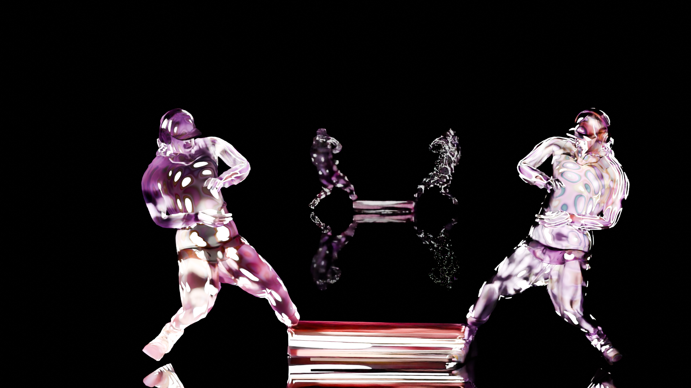
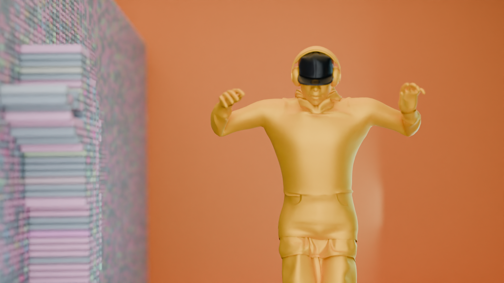
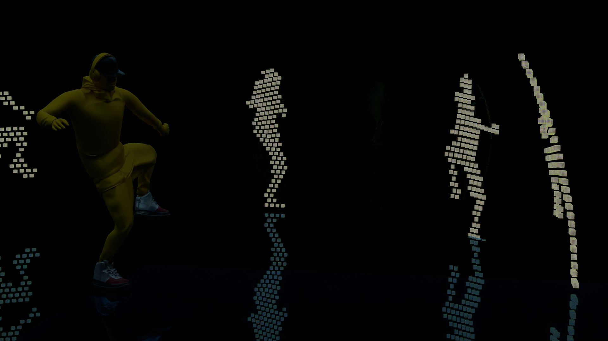

# BlenderProjects

This repository contains beginner-friendly Blender experiments

These projects are designed to help beginners understand the fundamentals of Blender through simple examples
---

##  Project Folder: `Geometry/`

Inside the `Geometry` folder, you'll find multiple `.blend` files and renders related to different procedural and node-based effects.

### 🔧 Example Projects

| Project | Description | Preview |
|--------|-------------|---------|
| `raycastt.blend` | Raycasting using geometry nodes |  |
| `proximity.blend` | Distance-based proximity effects |  |
| `curvess.blend` | Curve-to-geometry effects |  |

> All `.blend` files and assets are fully editable. Use them to learn or build your own procedural systems.

---

## 🧠 Who is this for?

- 🆕 Blender beginners
- 🧪 Curious learners exploring Geometry Nodes
- 🎓 Students looking to build fundamentals with small projects

---

## 📌 How to Use

1. Download any `.blend` file from the [`Geometry/`](https://github.com/vivekrao0205/BlenderProjects/tree/main/Geometry) folder
2. Open it in Blender 3.0+
3. Press **Play** or explore the **Geometry Nodes** workspace

---
